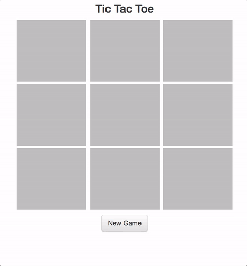

# Tic Tac Toe with OOP

The goal of this assignment is to implement tic tac toe using object oriented programming.  You are given an html file, `index.html` that you can use as a game board.  Feel free to modify it in any way you see fit.

Remember to stop and think about how you want to design your code before start coding!

### Sample Solution

Here is a gif of a sample solution to tic tac toe:

