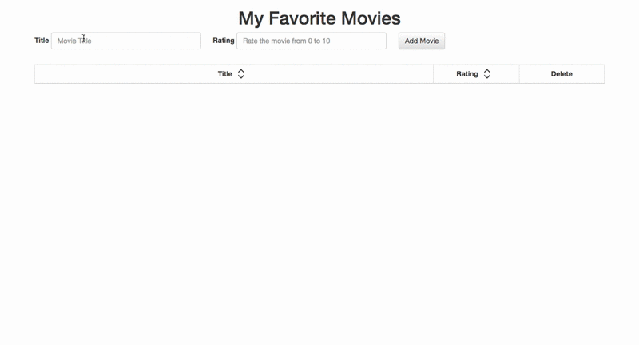

## jQuery Exercise

### Part 1

Build a list page where users can add and rate examples from a category (e.g. movies, albums, or sports). This page should include the following:

1. A form, where you can add something to the list and rate it.
2. A table of all of the things you've added.
3. A delete button for each row of the table that lets you remove elements from the list.
4. BONUS: a sorting feature, so you can sort entries in the table by their title or their rating. (To implement this you may need to research JavaScript's `sort` method.)

Here's an example of a movie list page:

All DOM manipulation should be done using jQuery - don't use any vanilla JavaScript properties or methods to interact with the DOM!

### Part 2

If you're looking for even more practice, you can use your jQuery knowledge to build a game in the browser! You can refactor one of your older assignments or build something new. Here are some options:

- A racing game by moving/animating elements in the DOM
- A card game like blackjack or poker
- A fun board game like connect-four  