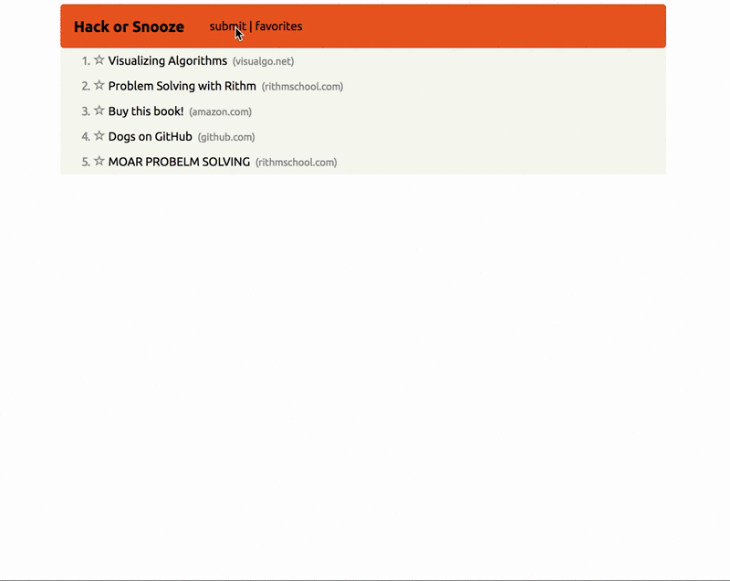

## jQuery Exercise

Your task in this exercise is to build a simple clone of [Hacker News](https://news.ycombinator.com/) using jQuery. Here's a quick GIF showcasing the functionality (explicit requirements are below):

__Requirements__

* Users should be able to toggle a form used to add a new story.
* After submitting the form, the story should be added to the list of stories.
* If the URL entered in the form is invalid, the browser should prompt the user to enter a valid url.
* Users can click on a star next to a story to mark it as a "favorite."
* Style your app! 

__BONUS__

* Users can click on a "favorites" option in the nav bar to show only stories that they have favorited. Clicking on it again shows all stories.
* In addition to displaying the title of each story, display the hostname for the corresponding URL. When users click on the hostname, all stories with different hostnames are filtered out (compare to the same functionality on Hacker News).

Good luck!